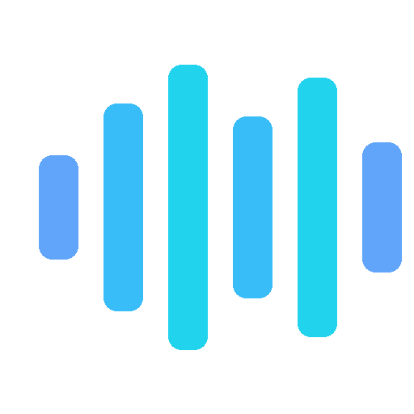

<p align="center">
  
</p>

# Open Audio Orchestrator

> **This project is an independent open-source tool and is not affiliated with, sponsored by, or endorsed by the Fish Audio team.**

A local Blazor Server dashboard for managing Fish Speech Docker containers with voice cloning, TTS generation, and real-time monitoring.

[](https://www.gnu.org/licenses/gpl-3.0)

## Overview

Open Audio Orchestrator runs locally on Windows or Linux and manages [Fish Speech](https://github.com/fishaudio/fish-speech) Docker containers via Docker Desktop (Windows) or Docker CE (Linux). It provides a web interface for deploying TTS models, managing a voice reference library, generating speech via a background job queue, and monitoring container health and GPU metrics in real time.

## Features

- **Docker container orchestration** — create, start, stop, swap, and remove Fish Speech containers
- **Voice library** — upload reference audio for voice cloning, tag and organize voices (see [Fish Audio's guide](https://fish.audio/blog/voice-cloning-guide/) for best practices)
- **Background TTS job queue** — submit speech generation requests that process serially in the background; navigate freely while jobs run, with real-time status updates
- **App restart resilience** — TTS generation runs inside the container via `docker exec curl`, surviving app restarts; on recovery, completed files are detected automatically
- **Real-time dashboard** — live container status, GPU memory/core utilization (5-second refresh), and latest model output
- **Container log streaming** — live Docker log viewer with backfill, per-container subscription, newest-first ordering
- **Generation history** — log of all TTS generations with playback, download, and delete; updates dynamically when jobs complete
- **Authentication** — ASP.NET Identity with mandatory TOTP/MFA, cryptographic one-time sign-in tokens, rate-limited login (10 req/min per IP)
- **Role-based access control** — Admin (full access) and User (TTS, voice browsing, own history)
- **Authenticated file serving** — audio output and reference files served through authorized endpoints with canonical path traversal protection
- **Database encryption** — optional SQLCipher at-rest encryption configured during setup; encryption key protected by ASP.NET Data Protection API; database file permissions automatically restricted to the app user
- **Light/dark theme** — per-user theme preference stored in the database; neutral grey dark theme and clean white light theme; instant toggle in the navbar
- **Security headers** — CSP, X-Frame-Options, X-Content-Type-Options, Referrer-Policy
- **First-run setup wizard** — 7-step guided installer covering database location, data directories, model download, Docker image pull, server configuration (including database encryption), admin account creation, and TOTP enrollment
- **HTTPS** — optional automatic certificate provisioning via Let's Encrypt (ports 80/443)
- **API gateway** — YARP reverse proxy for the Fish Speech TTS API
- **Health monitoring** — periodic container health checks; uses Docker container status during active TTS generation to avoid false errors
- **Server-side event bus** — in-process event system for real-time UI updates without client-side SignalR connections

## Prerequisites

- NVIDIA GPU with CUDA drivers
- Docker (Desktop on Windows, CE on Linux)
- .NET 9 SDK
- Git with Git LFS

Platform-specific setup instructions:
- **Windows:** [`docs/WINDOWS-SETUP.md`](docs/WINDOWS-SETUP.md)
- **Linux:** [`docs/LINUX-SETUP.md`](docs/LINUX-SETUP.md) (Debian/Ubuntu, RHEL/Fedora, Alpine)

## Quick Start

```bash
git clone https://github.com/bilbospocketses/OpenAudioOrchestrator.git
cd OpenAudioOrchestrator
dotnet run --project src/OpenAudioOrchestrator.Web
```

Navigate to `http://localhost:5206` and complete the 7-step setup wizard. After setup, restart the app and log in with your admin credentials. See the platform setup guides above for detailed instructions.

## Model Notes

- The **s2-pro** model requires the `server-cuda-v2.0.0-beta` Docker image (the latest `server-cuda` tag has a [torchaudio compatibility issue](https://github.com/fishaudio/fish-speech/issues/1118))
- The model uses ~22 GB VRAM — on a card with less than 24 GB it spills to system RAM, resulting in slower generation (~9s/token). A 24 GB+ GPU is recommended for production use
- FP16 (`--half`) is enabled by default and recommended for cards with 12 GB VRAM or less
- For voice cloning reference audio guidelines, see the [Fish Audio Voice Cloning Guide](https://fish.audio/blog/voice-cloning-guide/)

## Configuration

Most settings are configured automatically by the setup wizard. The app auto-detects your platform and applies appropriate defaults. For advanced use or manual changes, edit `src/OpenAudioOrchestrator.Web/appsettings.json`:

| Key | Description |
|-----|-------------|
| `ConnectionStrings:Default` | SQLite database path |
| `OpenAudioOrchestrator:DockerEndpoint` | Docker API endpoint |
| `OpenAudioOrchestrator:DataRoot` | Root directory for data files |
| `OpenAudioOrchestrator:PortRange:Start` | Start of container port range (default: `9001`) |
| `OpenAudioOrchestrator:PortRange:End` | End of container port range (default: `9099`) |
| `OpenAudioOrchestrator:DefaultImageTag` | Default Fish Speech Docker image |
| `OpenAudioOrchestrator:DockerNetworkName` | Docker bridge network name (default: `oao-network`) |
| `OpenAudioOrchestrator:HealthCheckIntervalSeconds` | Health check frequency in seconds (default: `30`) |
| `OpenAudioOrchestrator:Domain` | FQDN for Let's Encrypt (blank = localhost) |
| `OpenAudioOrchestrator:DatabaseKey` | SQLCipher encryption key (Data Protection encrypted) |
| `OpenAudioOrchestrator:AdminUser` | Seed admin username (env var override) |
| `OpenAudioOrchestrator:AdminPassword` | Seed admin password (env var override) |
| `LettuceEncrypt:AcceptTermsOfService` | Accept Let's Encrypt terms (default: `true`) |
| `LettuceEncrypt:DomainNames` | Domain names for certificate |
| `LettuceEncrypt:EmailAddress` | Email for certificate renewal notices |

For automated deployments, set `OpenAudioOrchestrator__AdminUser` and `OpenAudioOrchestrator__AdminPassword` as environment variables to seed the admin account on first run (TOTP setup required on first login).

## Architecture

- **Blazor Server** (.NET 9) — interactive server-side UI with light/dark theme toggle (per-user preference)
- **SQLite** (EF Core) — model profiles, voice library, generation logs, TTS job queue, Identity tables; optional SQLCipher at-rest encryption
- **Docker.DotNet** — container lifecycle management and exec API for TTS generation (no shell-out)
- **docker exec (SDK)** — TTS generation runs inside the container via Docker SDK exec, writing output to mounted volume; survives app restarts
- **OrchestratorEventBus** — singleton in-process event bus with weak-reference subscriptions for real-time UI updates (replaces client-side SignalR hub connections)
- **YARP** — reverse proxy routing to the active Fish Speech container
- **SignalR** — hub retained for future external client support (authorized)
- **ASP.NET Identity** — authentication with mandatory TOTP/MFA; cookie operations via API endpoints for Blazor Server compatibility; rate-limited login; cryptographic TOTP verification tokens
- **LettuceEncrypt** — automatic Let's Encrypt HTTPS on ports 80/443 (optional, enabled when Domain is configured)

Design specifications are in [`docs/superpowers/specs/`](docs/superpowers/specs/).

## Development

```bash
# Build
dotnet build

# Run in development mode
dotnet run --project src/OpenAudioOrchestrator.Web

# Add an EF Core migration
cd src/OpenAudioOrchestrator.Web
dotnet ef migrations add <MigrationName>
```

## To Do

- [ ] Create a containerized Docker version of the Blazor app (publish prebuilt image to Docker Hub)
  - [ ] Remove YARP reverse proxy from containerized app; provide general guidance on using a separate reverse proxy running externally in another Docker container
- [x] ~~Create Linux native version (platform-aware paths, Linux setup instructions), and validate deployment on several Linux variants (Debian/Ubuntu, RH/Fedora, etc)~~
- [ ] Performance enhancements

## Attribution

This product includes Fish Audio Materials developed by [Fish Audio](https://fish.audio). Copyright (c) 2026 Fish Audio. All Rights Reserved.

**Built with Fish Audio.** The Fish Audio S2 Pro models are for non-commercial research use only. Commercial use requires a separate license from Fish Audio. See the [Fish Audio Research License](https://huggingface.co/fishaudio/s2-pro/blob/main/LICENSE.md) for details.

## License

This project is licensed under the GNU General Public License v3.0 — see the [LICENSE](LICENSE) file for details.

See [NOTICE](NOTICE) for third-party attribution requirements.
